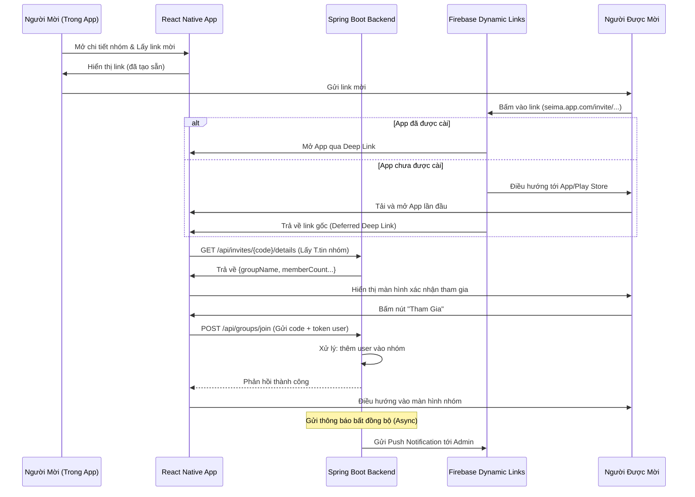

# Hướng Dẫn Mời Thành Viên Vào Nhóm

## Mô Tả

Tài liệu này mô tả quy trình mời người dùng tham gia nhóm thông qua liên kết mời (invitation link) sử dụng Firebase Dynamic Links.

## Quy Trình Mời Thành Viên

## Các Bước Chính

1. **Tạo Link Mời**: Người dùng trong app tạo link mời cho nhóm
2. **Chia Sẻ Link**: Gửi link mời cho người khác
3. **Xử Lý Deep Link**: Firebase Dynamic Links xử lý việc mở app hoặc tải app
4. **Lấy Thông Tin Nhóm**: App gọi API để lấy thông tin chi tiết nhóm
5. **Xác Nhận Tham Gia**: Người được mời xác nhận tham gia nhóm
6. **Thêm Vào Nhóm**: Backend xử lý thêm user vào nhóm
7. **Thông Báo**: Gửi thông báo cho admin về thành viên mới

## API Endpoints

- `GET /api/invites/{code}/details` - Lấy thông tin chi tiết về lời mời
- `POST /api/groups/join` - Tham gia nhóm bằng mã mời

## Công Nghệ Sử Dụng

- **React Native**: Ứng dụng mobile
- **Spring Boot**: Backend API
- **Firebase Dynamic Links**: Xử lý deep linking
- **Firebase Cloud Messaging**: Push notifications